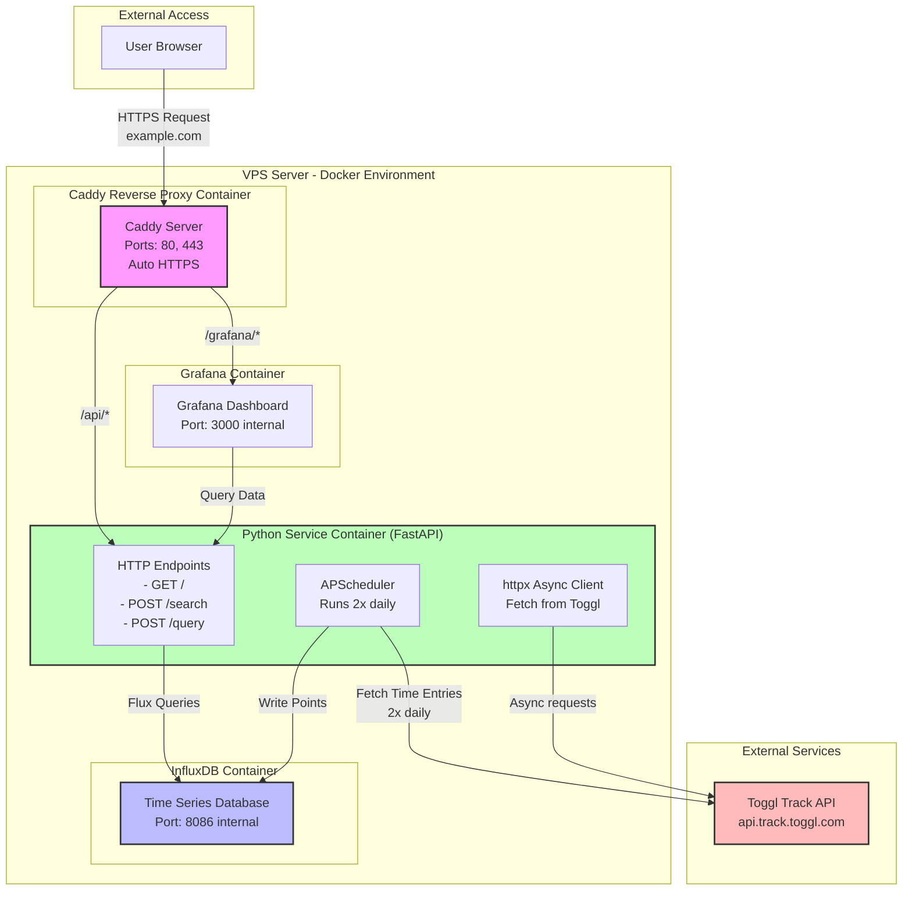

# Toggl Pulse: Project Overview

## Architecture Diagram



---

## Project Description

A fully containerized data pipeline that:
- Fetches time tracking data from **Toggl Track API** twice daily
- Stores time series data in **InfluxDB**
- Visualizes metrics through **Grafana dashboards**
- Provides secure access via **Caddy reverse proxy** with automatic HTTPS

All services run on a single VPS using Docker, with internal networking for security.

---

## Technology Stack

### Core Services

| Component | Technology | Purpose |
|-----------|-----------|---------|
| **Python Service** | FastAPI + Uvicorn | API endpoints + scheduled data fetching |
| **Database** | InfluxDB 2.7+ | Time series data storage |
| **Visualization** | Grafana (latest) | Interactive dashboards |
| **Reverse Proxy** | Caddy (alpine) | HTTPS termination, routing |

---

## Architecture Overview

### Single Unified Python Service

Instead of separate services, everything runs in one FastAPI application:

```
┌─────────────────────────────────────────────────────────┐
│     Docker Internal Network (Bridge)                    │
│                                                         │
│  ┌─────────────────────────────────────────────┐      │
│  │ Python Service (FastAPI + Uvicorn)         │      │
│  │                                             │      │
│  │  Port 8000 (internal)                      │      │
│  │  ├─ GET  /                (health check)   │      │
│  │  ├─ POST /search          (metrics list)   │      │
│  │  └─ POST /query           (time series)    │      │
│  │                                             │      │
│  │  Background Tasks (APScheduler):           │      │
│  │  ├─ Runs at 2 AM & 2 PM                    │      │
│  │  ├─ Fetches from Toggl (httpx)             │      │
│  │  └─ Writes to InfluxDB                     │      │
│  └─────────────────────────────────────────────┘      │
│                 ↕ (reads/writes)                       │
│  ┌─────────────────────────────────────────────┐      │
│  │ InfluxDB (Port 8086 - internal only)       │      │
│  │ - Stores time series data                   │      │
│  │ - No external exposure                      │      │
│  └─────────────────────────────────────────────┘      │
│                                                         │
│  ┌─────────────────────────────────────────────┐      │
│  │ Grafana (Port 3000 - internal only)        │      │
│  │ - Queries Python Service endpoints         │      │
│  │ - Visualizes data from InfluxDB            │      │
│  └─────────────────────────────────────────────┘      │
│                                                         │
└─────────────────────────────────────────────────────────┘
        ↑ (Only Caddy exposed to internet)
     Caddy
   (80, 443)
```

**Key Points:**
- Single FastAPI container handles both HTTP endpoints AND background scheduling
- Only Caddy is exposed to ports 80/443
- Services communicate by container name (e.g., `http://influxdb:8086`)
- InfluxDB is never exposed publicly
- All internal communication is unencrypted (within trusted network)

---

## Data Flow

### 1. Data Ingestion (Twice Daily)

```
Time: 2 AM or 2 PM UTC
   ↓
APScheduler triggers fetch job
   ↓
httpx (async HTTP client) fetches from Toggl API
   ├─ GET https://api.track.toggl.com/api/v9/me/time_entries
   └─ Returns: JSON array of time entries
   ↓
Python transformer converts each entry:
   ├─ ISO 8601 timestamp → Unix milliseconds
   ├─ Extract fields: duration, description
   ├─ Extract tags: project_id, workspace_id, billable
   └─ Format as InfluxDB point
   ↓
Write batch to InfluxDB
   ├─ Measurement: toggl_time_entry
   ├─ Tags: project_id, workspace_id, billable
   ├─ Fields: duration, description
   └─ Timestamp: start time (ms)
```

### 2. Data Visualization

```
User accesses https://example.com/grafana
   ↓
Caddy terminates HTTPS, routes to Grafana container
   ↓
Grafana loads dashboard in browser
   ↓
User creates/views panel with query
   ↓
Grafana calls Python Service endpoints:
   ├─ POST /search → returns available metrics
   └─ POST /query  → returns time series data
   ↓
Python Service queries InfluxDB
   ├─ Executes Flux query
   ├─ Transforms results to Grafana format
   └─ Returns: [[value, timestamp_ms], ...]
   ↓
Grafana visualizes the data on dashboard
```

---

## Toggl API Integration

### Authentication
- Method: Basic Auth
- Credentials: Toggl email + password (or API token)

### Endpoint
```
GET https://api.track.toggl.com/api/v9/me/time_entries
```

### Response Format
```json
[
  {
    "id": 123456789,
    "workspace_id": 12345,
    "project_id": 67890,
    "description": "Working on feature X",
    "start": "2025-11-11T08:00:00Z",
    "stop": "2025-11-11T10:30:00Z",
    "duration": 9000,
    "billable": true,
    "tags": ["development", "backend"]
  }
]
```

### Required Transformations

| Toggl Field | InfluxDB Mapping | Transformation |
|------------|------------------|----------------|
| `start` | Timestamp | ISO 8601 → Unix ms |
| `duration` | Field | Store as-is (seconds) |
| `description` | Field | Store as string |
| `project_id` | Tag | String conversion |
| `workspace_id` | Tag | String conversion |
| `billable` | Tag | Boolean → string |
| `tags` | Tag | Array → pipe-separated string |

---

## Deployment Configuration

### docker-compose.yml

```yaml
version: '3.8'

services:
  influxdb:
    image: influxdb:2.7
    container_name: influxdb
    environment:
      - INFLUXDB_DB=toggl_metrics
      - INFLUXDB_ADMIN_USER=admin
      - INFLUXDB_ADMIN_PASSWORD=${INFLUXDB_ADMIN_PASSWORD}
    volumes:
      - influxdb_data:/var/lib/influxdb2
    networks:
      - internal_network
    expose:
      - "8086"
    restart: unless-stopped

  python-service:
    build: ./python-service
    container_name: python-service
    environment:
      - TOGGL_API_TOKEN=${TOGGL_API_TOKEN}
      - INFLUXDB_URL=http://influxdb:8086
      - INFLUXDB_TOKEN=${INFLUXDB_TOKEN}
      - INFLUXDB_ORG=${INFLUXDB_ORG}
      - INFLUXDB_BUCKET=${INFLUXDB_BUCKET}
      - LOG_LEVEL=INFO
    depends_on:
      - influxdb
    networks:
      - internal_network
    expose:
      - "8000"
    restart: unless-stopped

  grafana:
    image: grafana/grafana:latest
    container_name: grafana
    environment:
      - GF_SECURITY_ADMIN_PASSWORD=${GRAFANA_ADMIN_PASSWORD}
      - GF_SERVER_ROOT_URL=https://example.com/grafana
    volumes:
      - grafana_data:/var/lib/grafana
    depends_on:
      - python-service
    networks:
      - internal_network
    expose:
      - "3000"
    restart: unless-stopped

  caddy:
    image: caddy:alpine
    container_name: caddy
    ports:
      - "80:80"
      - "443:443"
    volumes:
      - ./Caddyfile:/etc/caddy/Caddyfile:ro
      - caddy_data:/data
    depends_on:
      - grafana
      - python-service
    networks:
      - internal_network
    restart: unless-stopped

volumes:
  influxdb_data:
  grafana_data:
  caddy_data:

networks:
  internal_network:
    driver: bridge
```

### Caddyfile

```caddyfile
example.com {
    # Grafana dashboard
    handle /grafana/* {
        reverse_proxy grafana:3000
    }

    # Python service API
    handle /api/* {
        reverse_proxy python-service:8000
    }

    # Root redirect
    handle / {
        redir /grafana/
    }
}
```

---

## Python Service Implementation

### Project Structure

```
python-service/
├── Dockerfile
├── requirements.txt
├── main.py                    # FastAPI app with endpoints + scheduler
├── config.py                  # Pydantic settings
├── models.py                  # Request/response schemas
└── services/
    ├── toggl_client.py        # Toggl API wrapper (httpx)
    ├── influxdb_client.py     # InfluxDB operations (read & write)
    └── transformer.py         # Data transformation logic
```

### Dockerfile

```dockerfile
FROM python:3.12-slim

WORKDIR /app

COPY requirements.txt .
RUN pip install --no-cache-dir -r requirements.txt

COPY . .

CMD ["uvicorn", "main:app", "--host", "0.0.0.0", "--port", "8000"]
```

### config.py

```python
from pydantic_settings import BaseSettings

class Settings(BaseSettings):
    # Toggl API
    toggl_api_token: str

    # InfluxDB
    influxdb_url: str = "http://localhost:8086"
    influxdb_token: str
    influxdb_org: str
    influxdb_bucket: str

    # App
    log_level: str = "INFO"

    class Config:
        env_file = ".env"
        env_file_encoding = "utf-8"

settings = Settings()
```

### models.py

```python
from pydantic import BaseModel, Field
from typing import Optional

class TimeRange(BaseModel):
    from_: str = Field(alias="from")
    to: str

class Target(BaseModel):
    target: str
    refId: str
    payload: dict = {}

class QueryRequest(BaseModel):
    range: TimeRange
    targets: list[Target]
    intervalMs: int
    maxDataPoints: int

class TimeSeries(BaseModel):
    target: str
    refId: str
    datapoints: list[list]  # [[value, timestamp_ms], ...]

class SearchRequest(BaseModel):
    target: str = ""
```

### main.py

```python
from fastapi import FastAPI, HTTPException
from contextlib import asynccontextmanager
from apscheduler.schedulers.background import BackgroundScheduler
from apscheduler.triggers.cron import CronTrigger
import logging
from config import settings
from models import QueryRequest, SearchRequest, TimeSeries
from services.toggl_client import TogglClient
from services.influxdb_client import InfluxDBClient
from services.transformer import transform_toggl_data

logging.basicConfig(level=settings.log_level)
logger = logging.getLogger(__name__)

scheduler = BackgroundScheduler()

async def fetch_and_store_toggl():
    """Fetch all time entries from Toggl and store in InfluxDB"""
    try:
        logger.info("Starting Toggl fetch...")

        # Fetch from Toggl using httpx
        toggl = TogglClient(settings.toggl_api_token)
        entries = await toggl.get_all_time_entries()

        if not entries:
            logger.warning("No time entries found")
            return

        # Transform entries
        influxdb_points = []
        for entry in entries:
            point = transform_toggl_data(entry)
            influxdb_points.append(point)

        # Write to InfluxDB
        influx = InfluxDBClient(
            url=settings.influxdb_url,
            token=settings.influxdb_token,
            org=settings.influxdb_org,
            bucket=settings.influxdb_bucket
        )
        await influx.write_points(influxdb_points)

        logger.info(f"Successfully stored {len(influxdb_points)} time entries")

    except Exception as e:
        logger.error(f"Error fetching Toggl data: {str(e)}")

@asynccontextmanager
async def lifespan(app: FastAPI):
    # Startup: start scheduler
    scheduler.add_job(
        fetch_and_store_toggl,
        CronTrigger(hour='2,14', minute='0')  # 2 AM and 2 PM UTC
    )
    scheduler.start()
    logger.info("Scheduler started - fetching at 2 AM and 2 PM UTC")

    yield  # App runs here

    # Shutdown: stop scheduler
    scheduler.shutdown()
    logger.info("Scheduler stopped")

app = FastAPI(title="Toggl Grafana Bridge", lifespan=lifespan)

# ==================== HEALTH CHECK ====================
@app.get("/")
async def health():
    """Health check endpoint"""
    return {"status": "ok"}

# ==================== GRAFANA ENDPOINTS ====================
@app.post("/search")
async def search(request: SearchRequest):
    """Return available metrics for Grafana dropdown"""
    try:
        influx = InfluxDBClient(
            url=settings.influxdb_url,
            token=settings.influxdb_token,
            org=settings.influxdb_org,
            bucket=settings.influxdb_bucket
        )
        metrics = await influx.get_available_metrics()
        return metrics
    except Exception as e:
        logger.error(f"Search error: {str(e)}")
        raise HTTPException(status_code=500, detail=str(e))

@app.post("/query")
async def query(request: QueryRequest) -> list[TimeSeries]:
    """Return time series data for Grafana"""
    try:
        results = []

        influx = InfluxDBClient(
            url=settings.influxdb_url,
            token=settings.influxdb_token,
            org=settings.influxdb_org,
            bucket=settings.influxdb_bucket
        )

        for target in request.targets:
            # Query InfluxDB for the target
            tables = await influx.query(
                measurement=target.target,
                start=request.range.from_,
                end=request.range.to
            )

            # Transform to Grafana format
            datapoints = []
            for table in tables:
                for record in table.records:
                    ts_ms = int(record.get_time().timestamp() * 1000)
                    datapoints.append([record.get_value(), ts_ms])

            results.append(TimeSeries(
                target=target.target,
                refId=target.refId,
                datapoints=sorted(datapoints, key=lambda x: x[1])
            ))

        return results
    except Exception as e:
        logger.error(f"Query error: {str(e)}")
        raise HTTPException(status_code=500, detail=str(e))

@app.post("/annotations")
async def annotations():
    """Optional: Return annotations for graphs"""
    return []

if __name__ == "__main__":
    import uvicorn
    uvicorn.run(app, host="0.0.0.0", port=8000)
```

### services/toggl_client.py

```python
import httpx
from datetime import datetime, timedelta

class TogglClient:
    def __init__(self, api_token: str):
        self.api_token = api_token
        self.base_url = "https://api.track.toggl.com/api/v9"

    async def get_all_time_entries(self, days_back: int = 7):
        """Fetch time entries from last N days"""
        async with httpx.AsyncClient() as client:
            start_date = (datetime.utcnow() - timedelta(days=days_back)).isoformat()

            response = await client.get(
                f"{self.base_url}/me/time_entries",
                auth=(self.api_token, "api_token"),
                params={"start_date": start_date}
            )
            response.raise_for_status()
            return response.json()
```

### services/influxdb_client.py

```python
from influxdb_client.client.influxdb_client_async import InfluxDBClientAsync
from influxdb_client.client.write_api import SYNCHRONOUS

class InfluxDBClient:
    def __init__(self, url: str, token: str, org: str, bucket: str):
        self.url = url
        self.token = token
        self.org = org
        self.bucket = bucket

    async def write_points(self, points: list):
        """Write data points to InfluxDB"""
        async with InfluxDBClientAsync(
            url=self.url,
            token=self.token,
            org=self.org
        ) as client:
            write_api = client.write_api()
            await write_api.write(bucket=self.bucket, records=points)

    async def query(self, measurement: str, start: str, end: str):
        """Query InfluxDB for time series data"""
        async with InfluxDBClientAsync(
            url=self.url,
            token=self.token,
            org=self.org
        ) as client:
            query_api = client.query_api()
            query = f'''
            from(bucket: "{self.bucket}")
            |> range(start: {start}, stop: {end})
            |> filter(fn: (r) => r["_measurement"] == "{measurement}")
            '''
            return await query_api.query(query)

    async def get_available_metrics(self) -> list:
        """Get list of available measurements"""
        async with InfluxDBClientAsync(
            url=self.url,
            token=self.token,
            org=self.org
        ) as client:
            query_api = client.query_api()
            query = f'''
            import "influxdata/influxdb/schema"
            schema.measurements(bucket: "{self.bucket}")
            '''
            tables = await query_api.query(query)

            metrics = []
            for table in tables:
                for record in table.records:
                    metrics.append(record.values.get("_value"))
            return metrics
```

### services/transformer.py

```python
from datetime import datetime

def transform_toggl_data(entry: dict) -> dict:
    """Transform Toggl API response to InfluxDB point format"""

    # Parse ISO 8601 start time to Unix milliseconds
    start_dt = datetime.fromisoformat(entry['start'].replace('Z', '+00:00'))
    timestamp_ms = int(start_dt.timestamp() * 1000)

    # Build tags (indexed metadata for efficient querying)
    tags = {
        "project_id": str(entry.get("project_id", "unknown")),
        "workspace_id": str(entry.get("workspace_id", "unknown")),
        "billable": str(entry.get("billable", False)),
    }

    # Add Toggl tags if present
    if entry.get("tags"):
        tags["tags"] = "|".join(entry["tags"])

    # Build fields (actual data to store)
    fields = {
        "duration": entry.get("duration", 0),
        "description": entry.get("description", ""),
    }

    return {
        "measurement": "toggl_time_entry",
        "tags": tags,
        "fields": fields,
        "time": timestamp_ms
    }
```

### .env Template

```bash
# Toggl API
TOGGL_API_TOKEN=your_toggl_api_token

# InfluxDB
INFLUXDB_ADMIN_PASSWORD=your_secure_password
INFLUXDB_TOKEN=your_influxdb_token
INFLUXDB_ORG=your_org_name
INFLUXDB_BUCKET=toggl_metrics

# Grafana
GRAFANA_ADMIN_PASSWORD=your_grafana_password

# App
LOG_LEVEL=INFO
```

---

## Security Considerations

- ✅ **Database isolation:** InfluxDB only accessible internally
- ✅ **HTTPS by default:** Caddy auto-provisions SSL certificates
- ✅ **Secrets management:** All credentials in `.env` (git-ignored)
- ✅ **Network isolation:** Docker bridge network separates from host
- ✅ **Type safety:** Pydantic validates all inputs
- ✅ **Async operations:** httpx prevents blocking on I/O
